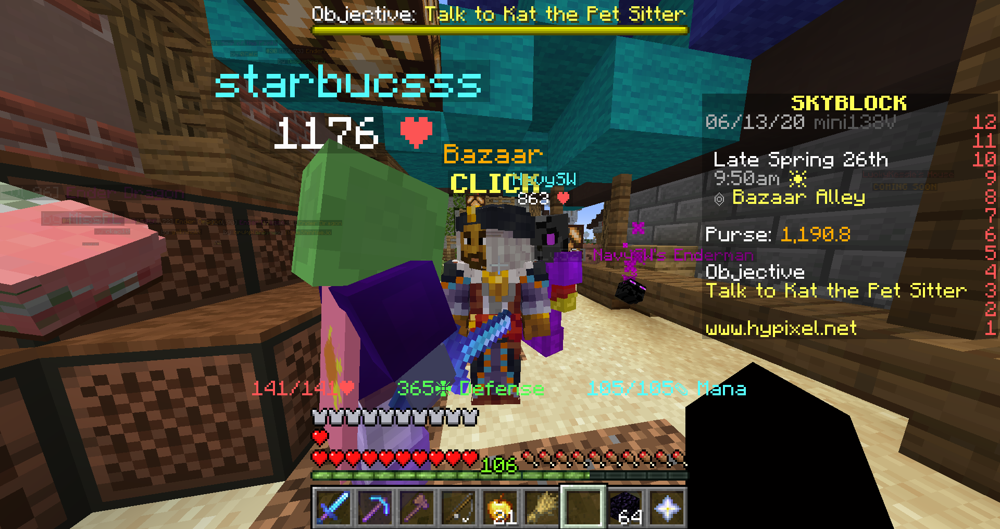

# SkyBlockAutoBazaarTrader

 A auto-trader for Hypixel Skyblock's bazaar.

SkyBlock has a NPC named the Bazaar, and you can buy and sell items, and the price will fluctuate.

This tool will automatically trade an item of your choice.

Instructions: 
============

Download the script.

Install pyautogui (pip install pyautogui), keyboard (pip install keyboard), and python (https://www.python.org/). 

Enter the GUI for the bazaar, and open up the item you want to buy, and it's trading options.

Set script variable itemTrading to be the ID of the item to sell. Create an image /images/ITEM_ID_NAME.png to be the icon of the item you want to trade.

Begin the script.

Dependencies
============

Python 2-3 (https://www.python.org/)

PyAutoGui "pip install pyautogui" (https://pypi.org/project/PyAutoGUI/)

keyboard "pip install keyboard" (https://pypi.org/project/keyboard/)

NOTE
====

This may be bannable on hypixel, I think. Also, this really won't do much, the price fluctuations are to trivial to notice. It has many bugs, especially for a script written by a bored 11 year old in quarintine.
